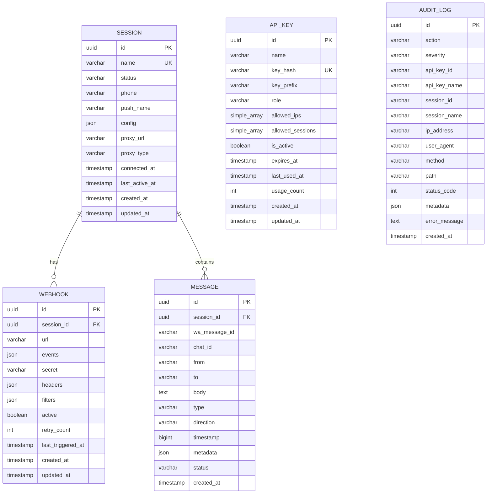
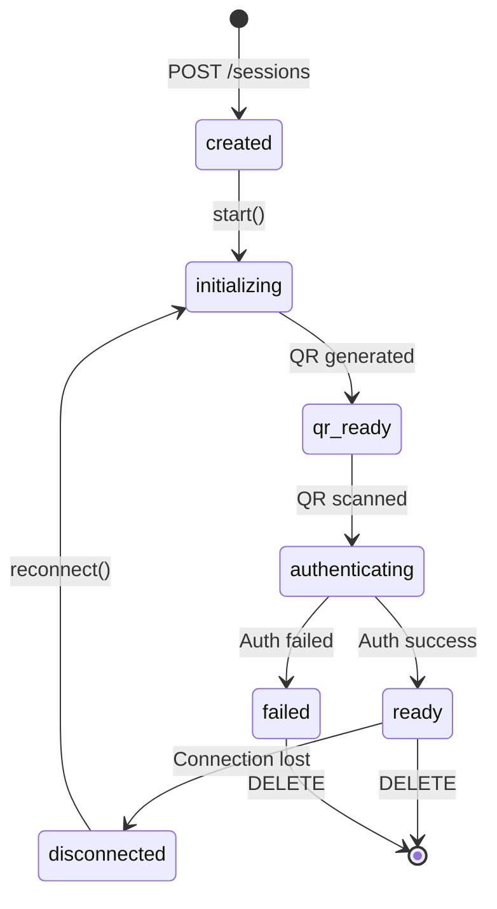
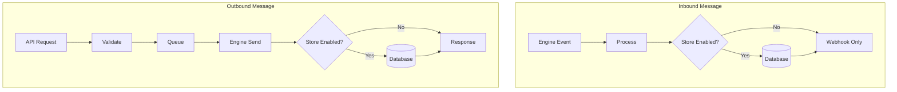
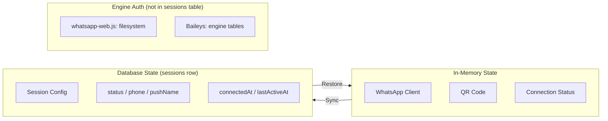
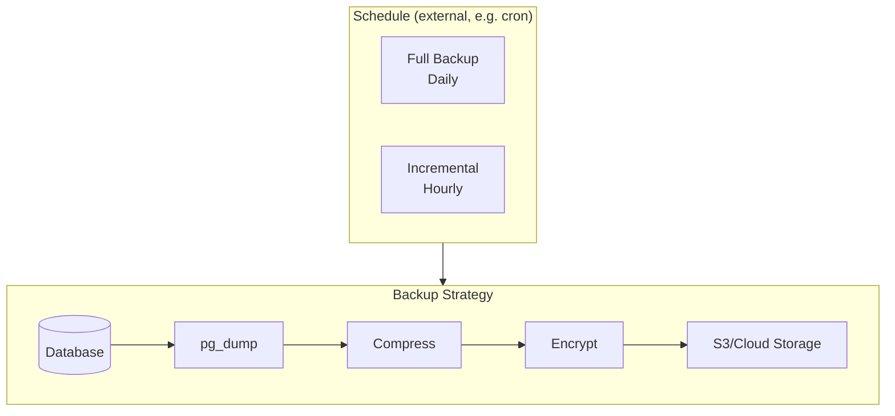

# 05 - Database Design

## 5.1 Overview

OpenWA uses a database to store:

- Session configuration & state
- Webhook configurations
- Message history (optional)
- API keys & authentication
- Audit logs

### Database Support

OpenWA supports two database backends that can be selected at deployment time:

| Database       | Use Case                                    | Sessions | Horizontal Scaling |
| -------------- | ------------------------------------------- | -------- | ------------------ |
| **SQLite**     | Development, personal bot, low-resource VPS | 1-5      | ❌                 |
| **PostgreSQL** | Production, multi-session, high volume      | 5+       | ✅                 |

> [!NOTE]
> **SQLite as a Production Option**
>
> SQLite can be used in production with limitations:
>
> - Maximum ~5 concurrent sessions (due to single-writer limitation)
> - Single-file storage — back up `./data/*.sqlite` rather than relying on a dump tool
> - No horizontal scaling support
> - Ideal for: personal bots, small businesses with 1-3 WhatsApp numbers
>
> For configuration, see [03 - System Architecture: Pluggable Adapters](./03-system-architecture.md#312-pluggable-adapters)

### Dual-Database Architecture

OpenWA v0.2+ implements a **dual-database architecture** that separates boot configuration from user data:

```
┌─────────────────────────────────────────────────────────────────┐
│                        OpenWA Application                        │
├─────────────────────────────┬───────────────────────────────────┤
│      Main DB (SQLite)       │        Data DB (Pluggable)        │
│     Always ./data/main.db   │   SQLite or PostgreSQL (config)   │
├─────────────────────────────┼───────────────────────────────────┤
│ • api_keys                  │ • sessions                        │
│ • audit_logs                │ • webhooks                        │
│                             │ • messages                        │
│                             │ • message_batches                 │
│                             │ • templates                       │
│                             │ • (engine: baileys_stored_messages, lid_mappings) │
└─────────────────────────────┴───────────────────────────────────┘
```

| Component   | Database             | Location             | Purpose                                    |
| ----------- | -------------------- | -------------------- | ------------------------------------------ |
| **Main DB** | SQLite (always)      | `./data/main.sqlite` | Boot-critical config, API keys, audit logs |
| **Data DB** | SQLite or PostgreSQL | Configurable         | User data, sessions, messages, webhooks    |

> [!IMPORTANT]
> **Why Dual-Database?**
>
> The Main DB is always SQLite to ensure the application can bootstrap without external dependencies:
>
> - API keys needed for authentication before any external DB connection
> - Audit logs must persist even if Data DB fails
> - Enables switching Data DB type without losing authentication

#### Pre-Bootstrap PostgreSQL Orchestration

When using PostgreSQL Built-in mode, OpenWA automatically:

1. Starts PostgreSQL container **before** NestJS bootstrap
2. Waits for health check (max 60 seconds)
3. Proceeds with application initialization

```typescript
// main.ts - Pre-bootstrap flow
if (process.env.POSTGRES_BUILTIN === 'true') {
  await preBootstrapPostgres(); // Start & wait for healthy
}
const app = await NestFactory.create(AppModule); // Then bootstrap
```

#### Data Migration API

OpenWA provides endpoints for migrating data between database types:

| Endpoint                 | Method | Description                          |
| ------------------------ | ------ | ------------------------------------ |
| `/api/infra/export-data` | GET    | Export all Data DB tables as JSON    |
| `/api/infra/import-data` | POST   | Import JSON data (replaces existing) |

**Migration Workflow:**

```bash
# 1. Export from current database
curl -s 'http://localhost:2785/api/infra/export-data' \
  -H 'X-API-Key: YOUR_KEY' > backup.json

# 2. Change database configuration (SQLite → PostgreSQL or vice versa)

# 3. Restart application with new config

# 4. Import to new database
curl -X POST 'http://localhost:2785/api/infra/import-data' \
  -H 'X-API-Key: YOUR_KEY' \
  -H 'Content-Type: application/json' \
  -d @backup.json
```

#### Cross-Database Date Portability

To ensure date/time values work across both SQLite and PostgreSQL, OpenWA uses a `DateTransformer` that stores dates as ISO 8601 text strings:

```typescript
// src/common/transformers/date.transformer.ts
export const DateTransformer: ValueTransformer = {
  from: (value: string | null) => value ? new Date(value) : null,
  to: (value: Date | null) => value ? value.toISOString() : null,
};

// Usage in entities (Data DB only)
@Column({ type: 'text', nullable: true, transformer: DateTransformer })
connectedAt: Date | null;
```

> [!NOTE]
> Main DB entities (api_keys, audit_logs) use native SQLite `datetime` type since they always remain in SQLite.

## 5.2 Entity Relationship Diagram



## 5.3 Table Specifications

### 5.3.1 sessions

Stores WhatsApp session configuration and state.

```sql
CREATE TABLE sessions (
    id UUID PRIMARY KEY DEFAULT gen_random_uuid(),
    name VARCHAR(100) NOT NULL UNIQUE,
    status VARCHAR(50) NOT NULL DEFAULT 'created',
    phone VARCHAR(20),
    push_name VARCHAR(100),
    config JSONB NOT NULL DEFAULT '{}',
    proxy_url VARCHAR(255),
    proxy_type VARCHAR(10),
    connected_at TIMESTAMP WITH TIME ZONE,
    last_active_at TIMESTAMP WITH TIME ZONE,
    created_at TIMESTAMP WITH TIME ZONE NOT NULL DEFAULT NOW(),
    updated_at TIMESTAMP WITH TIME ZONE NOT NULL DEFAULT NOW()
);
```

> [!NOTE]
> The SQL above is illustrative — the schema is defined by the TypeORM entity (`src/modules/session/entities/session.entity.ts`), and column types are dialect-portable (`jsonColumnType()` → `simple-json`, dates via `DateTransformer`). The `sessions` entity declares only the index implied by the `UNIQUE` constraint on `name`; there are no separate `status`/`phone`/`created_at` indexes.

> [!NOTE]
> Auth state is **not** stored in this table. Both engines persist credentials on the **filesystem** (`whatsapp-web.js` LocalAuth; Baileys `useMultiFileAuthState`). The `baileys_stored_messages` table holds only Baileys' serialized message store (the library ships none), not credentials.

**Session Status Values:**



| Status           | Description                  |
| ---------------- | ---------------------------- |
| `created`        | Session created, not started |
| `initializing`   | Starting browser & WhatsApp  |
| `qr_ready`       | QR code ready for scanning   |
| `authenticating` | QR scanned, authenticating   |
| `ready`          | Connected and ready          |
| `disconnected`   | Disconnected, can reconnect  |
| `failed`         | Failed, needs recreation     |

**Config Schema:**

```json
{
  "autoReconnect": true,
  "maxReconnectAttempts": 5,
  "puppeteer": {
    "headless": true,
    "args": ["--no-sandbox"]
  },
  "proxy": {
    "host": "proxy.example.com",
    "port": 8080,
    "username": "user",
    "password": "pass"
  }
}
```

---

### 5.3.2 webhooks

Stores webhook endpoint configurations.

```sql
CREATE TABLE webhooks (
    id UUID PRIMARY KEY DEFAULT gen_random_uuid(),
    session_id UUID NOT NULL REFERENCES sessions(id) ON DELETE CASCADE,
    url VARCHAR(2048) NOT NULL,
    events JSONB NOT NULL DEFAULT '["message.received"]',
    secret VARCHAR(255),
    headers JSONB DEFAULT '{}',
    filters JSONB,                       -- optional smart pre-filter; null = fire on every subscribed event
    active BOOLEAN NOT NULL DEFAULT true,
    retry_count INTEGER NOT NULL DEFAULT 3,
    last_triggered_at TIMESTAMP WITH TIME ZONE,
    created_at TIMESTAMP WITH TIME ZONE NOT NULL DEFAULT NOW(),
    updated_at TIMESTAMP WITH TIME ZONE NOT NULL DEFAULT NOW()
);
```

**Events Schema (allowed values):**

```json
[
  "message.received",
  "message.sent",
  "message.ack",
  "message.revoked",
  "message.reaction",
  "session.status",
  "session.qr",
  "session.authenticated",
  "session.disconnected",
  "group.join",
  "group.leave",
  "group.update"
]
```

---

### 5.3.3 messages

Stores message history (optional, can be disabled). This is a **plain (non-partitioned)** table — the same schema on SQLite and PostgreSQL.

```sql
CREATE TABLE messages (
    id UUID PRIMARY KEY DEFAULT gen_random_uuid(),
    session_id UUID NOT NULL,
    wa_message_id VARCHAR,                -- nullable; transient outgoing rows have none yet
    chat_id VARCHAR NOT NULL,
    "from" VARCHAR NOT NULL,
    "to" VARCHAR NOT NULL,
    body TEXT,
    type VARCHAR NOT NULL DEFAULT 'text',
    direction VARCHAR NOT NULL DEFAULT 'outgoing',  -- 'incoming' | 'outgoing'
    timestamp BIGINT,                     -- WhatsApp epoch seconds; read back as a JS number
    metadata JSONB,
    status VARCHAR NOT NULL DEFAULT 'sent',          -- pending | sent | delivered | read | failed
    created_at TIMESTAMP WITH TIME ZONE NOT NULL DEFAULT NOW()
);

-- Indexes (declared on the entity)
CREATE INDEX idx_messages_session_id ON messages(session_id);
CREATE INDEX idx_messages_session_created ON messages(session_id, created_at);
CREATE INDEX idx_messages_chat_id ON messages(chat_id);
CREATE INDEX idx_messages_status ON messages(status);

-- Inbound dedup (issue #464): one row per (session_id, wa_message_id).
-- NULL wa_message_id rows are exempt (SQL treats NULLs as distinct).
CREATE UNIQUE INDEX "UQ_messages_sessionId_waMessageId"
    ON messages(session_id, wa_message_id);
```

> [!NOTE]
> There is **no** PostgreSQL RANGE partitioning, `create_messages_partition()` function, or `pg_cron` schedule in OpenWA. `messages` is a single plain table on both backends. The `timestamp` column uses a `bigint→number` value transformer so the REST/SDK/MCP contract returns a JS number on both SQLite and PostgreSQL.

> [!NOTE]
> Message rows carry no separate `media`/`ack`/`from_me`/`is_group` columns. Media and other engine-specific details are stored in the `metadata` JSON column; delivery state is the `status` enum and `direction` distinguishes inbound vs. outbound.

---

### 5.3.4 (removed) contacts

> [!NOTE]
> **There is no `contacts` table.** Contacts are read live from the engine on demand (e.g. `GET /sessions/:id/contacts`) and are not persisted to the database.

---

### 5.3.5 api_keys

Stores API keys for authentication. Lives on the **main** (always-SQLite) connection.

```sql
CREATE TABLE api_keys (
    id VARCHAR PRIMARY KEY,
    name VARCHAR(100) NOT NULL,
    key_hash VARCHAR(64) NOT NULL,                 -- UNIQUE index
    key_prefix VARCHAR(12) NOT NULL,               -- shown in the UI; the full key is never stored
    role VARCHAR(20) NOT NULL DEFAULT 'operator',  -- admin | operator | viewer
    allowed_ips TEXT,                              -- simple-array (comma-joined), null = any IP
    allowed_sessions TEXT,                         -- simple-array, null = all sessions
    is_active BOOLEAN NOT NULL DEFAULT 1,
    expires_at DATETIME,
    last_used_at DATETIME,
    usage_count INTEGER NOT NULL DEFAULT 0,
    created_at DATETIME NOT NULL DEFAULT (datetime('now')),
    updated_at DATETIME NOT NULL DEFAULT (datetime('now'))
);

CREATE UNIQUE INDEX "IDX_api_keys_keyHash" ON api_keys(key_hash);
```

> [!NOTE]
> Access control is **role-based** (`admin` / `operator` / `viewer`), optionally scoped by `allowed_ips` and `allowed_sessions`. There is no granular `permissions` string array — see [04 - Security Design](./04-security-design.md) for what each role can do.

---

### 5.3.6 audit_logs

Consolidated audit trail for API-key, session, message, and webhook events. This is the **only** audit table — there are no separate `session_logs`, `webhook_logs`, or `api_key_logs` tables. Lives on the **main** (always-SQLite) connection.

```sql
CREATE TABLE audit_logs (
    id VARCHAR PRIMARY KEY,
    action VARCHAR(50) NOT NULL,                   -- e.g. session_created, message_sent, webhook_failed
    severity VARCHAR(10) NOT NULL DEFAULT 'info',  -- info | warn | error
    api_key_id VARCHAR(36),
    api_key_name VARCHAR(100),
    session_id VARCHAR(36),
    session_name VARCHAR(100),
    ip_address VARCHAR(45),
    user_agent VARCHAR(500),
    method VARCHAR(10),
    path VARCHAR(500),
    status_code INTEGER,
    metadata TEXT,                                 -- simple-json
    error_message TEXT,
    created_at DATETIME NOT NULL DEFAULT (datetime('now'))
);

-- Indexes (declared on the entity)
CREATE INDEX "IDX_audit_logs_action"    ON audit_logs(action);
CREATE INDEX "IDX_audit_logs_apiKeyId"  ON audit_logs(api_key_id);
CREATE INDEX "IDX_audit_logs_sessionId" ON audit_logs(session_id);
CREATE INDEX "IDX_audit_logs_createdAt" ON audit_logs(created_at);
```

**Audit actions** are an enum (`AuditAction`) spanning API-key lifecycle (`api_key_created`, `api_key_used`, `api_key_revoked`, `api_key_deleted`, `api_key_auth_failed`), session lifecycle (`session_created`, `session_started`, `session_stopped`, `session_force_killed`, `session_deleted`, `session_qr_generated`, `session_connected`, `session_disconnected`), messages (`message_sent`, `message_failed`), and webhooks (`webhook_created`, `webhook_deleted`, `webhook_triggered`, `webhook_failed`).

> [!NOTE]
> Audit-log retention is automatic: see [§5.7 Data Retention](#57-data-retention). Other event types (session logs, webhook delivery logs, API access logs) are surfaced via structured application logging, not dedicated database tables.

### 5.3.7 message_batches

Tracks bulk/batch message jobs. A single table holds the job state plus its messages, options, progress, and per-message results as JSON columns (there are **no** separate `batch_jobs` / `batch_job_messages` tables).

```sql
CREATE TABLE message_batches (
    id UUID PRIMARY KEY DEFAULT gen_random_uuid(),
    batch_id VARCHAR NOT NULL UNIQUE,
    session_id VARCHAR NOT NULL,
    status VARCHAR NOT NULL DEFAULT 'pending',   -- pending | processing | completed | cancelled | failed
    messages JSONB NOT NULL,                     -- [{ chatId, type, content, variables? }]
    options JSONB,                               -- { delayBetweenMessages, randomizeDelay, stopOnError }
    progress JSONB,                              -- { total, sent, failed, pending, cancelled }
    results JSONB,                               -- [{ chatId, status, messageId?, error?, sentAt? }]
    current_index INTEGER NOT NULL DEFAULT 0,
    created_at TIMESTAMP WITH TIME ZONE NOT NULL DEFAULT NOW(),
    updated_at TIMESTAMP WITH TIME ZONE NOT NULL DEFAULT NOW(),
    started_at TIMESTAMP WITH TIME ZONE,
    completed_at TIMESTAMP WITH TIME ZONE
);
```

**Batch Status Values:**

| Status       | Description                    |
| ------------ | ------------------------------ |
| `pending`    | Job created, not yet processed |
| `processing` | Sending messages in progress   |
| `completed`  | All messages processed         |
| `cancelled`  | Job cancelled by user          |
| `failed`     | Job failed (fatal error)       |

---

### 5.3.8 Other data-connection tables

The data connection also owns:

- **`templates`** — reusable message templates (`src/modules/template/entities/template.entity.ts`), with a unique constraint on `(sessionId, name)` — one template name per session.
- **`baileys_stored_messages`** — Baileys engine message store — the serialized WAMessage proto (`src/engine/adapters/baileys-stored-message.entity.ts`); present only when the Baileys engine is used. (Credentials live on the filesystem, not here.)
- **`lid_mappings`** — LID↔phone-number identity mappings (`src/engine/identity/lid-mapping.entity.ts`).

> [!NOTE]
> **Tables that do *not* exist.** Earlier drafts referenced `contacts`, `session_logs`, `webhook_logs`, `api_key_logs`, `webhook_idempotency`, and `ip_whitelist`. None of these are implemented. Contacts are read live from the engine; auditing is the single `audit_logs` table; webhook idempotency is not a persisted table; and per-key IP restrictions are stored inline on `api_keys.allowed_ips` (a `simple-array`), not in a separate `ip_whitelist` table.

---

## 5.4 Index Strategy

### Query Pattern Analysis

These indexes are the ones declared on the entities (see §5.3); the rows below map them to the hot query paths.

| Query Pattern                    | Index Used                                            | Frequency |
| -------------------------------- | ----------------------------------------------------- | --------- |
| Get session by ID                | `sessions.id` (PK)                                    | Very High |
| Get session by name              | `sessions.name` (UNIQUE)                              | High      |
| List messages by session (paged) | `(session_id, created_at)` composite                  | Very High |
| Look up message by chat          | `chat_id`                                             | High      |
| Ack/dedup a message              | `UQ_messages_sessionId_waMessageId` (UNIQUE)          | Very High |
| Authenticate API key             | `IDX_api_keys_keyHash` (UNIQUE, main DB)              | Very High |
| Filter audit logs                | `IDX_audit_logs_action` / `_apiKeyId` / `_sessionId`  | Medium    |

### Composite & Unique Indexes (as implemented)

```sql
-- messages: paged listing per session + ack-driven status update / inbound dedup
CREATE INDEX        idx_messages_session_created          ON messages(session_id, created_at);
CREATE UNIQUE INDEX "UQ_messages_sessionId_waMessageId"   ON messages(session_id, wa_message_id);

-- audit_logs (main DB): filter by action / key / session, ordered by time
CREATE INDEX "IDX_audit_logs_action"    ON audit_logs(action);
CREATE INDEX "IDX_audit_logs_createdAt" ON audit_logs(created_at);
```

> [!NOTE]
> The partial/filtered indexes shown in earlier drafts (e.g. `WHERE status = 'ready'`, `WHERE active = true`) are not part of the current schema. Add them only if a real query pattern justifies the maintenance cost.

### Index Maintenance

```sql
-- Check index usage
SELECT
    schemaname,
    tablename,
    indexname,
    idx_scan,
    idx_tup_read,
    idx_tup_fetch
FROM pg_stat_user_indexes
ORDER BY idx_scan DESC;

-- Find unused indexes
SELECT
    schemaname || '.' || relname AS table,
    indexrelname AS index,
    pg_size_pretty(pg_relation_size(i.indexrelid)) AS index_size,
    idx_scan as index_scans
FROM pg_stat_user_indexes ui
JOIN pg_index i ON ui.indexrelid = i.indexrelid
WHERE NOT indisunique
AND idx_scan < 50
ORDER BY pg_relation_size(i.indexrelid) DESC;

-- Reindex to reclaim space (run during maintenance window)
REINDEX TABLE messages;
```

## 5.5 Data Flow

### Message Storage Flow



### Session State Flow



## 5.6 Migration Strategy

OpenWA runs **two separate TypeORM connections**, each with its own migrations directory and CLI DataSource:

| Connection | DataSource              | Migrations dir              | Owns                                                                   |
| ---------- | ----------------------- | --------------------------- | ---------------------------------------------------------------------- |
| **main**   | `data-source-main.ts`   | `src/database/migrations-main/` | `api_keys`, `audit_logs` — always SQLite (`./data/main.sqlite`)    |
| **data**   | `data-source.ts`        | `src/database/migrations/`  | `sessions`, `webhooks`, `messages`, `message_batches`, `templates`, engine tables — SQLite **or** PostgreSQL |

Migrations are hand-authored (TypeORM `synchronize` is off for both connections in production) and are idempotent (`IF NOT EXISTS`) so they are safe to adopt on a database originally created by `synchronize`.

### Migration Files

```
src/database/migrations-main/      # main connection (auth + audit, SQLite)
└── 1779900000000-CreateAuthAuditTables.ts   # creates api_keys + audit_logs

src/database/migrations/           # data connection (pluggable)
├── 1770108659848-AddMessageStatus.ts
├── 1779235200000-AddUuidDefaultsForPostgres.ts   # Postgres-only: gen_random_uuid() id DEFAULTs
├── 1779840000000-AddTemplates.ts
├── 1779900100000-AddMessageSessionWaIndex.ts
├── 1781000000000-AddBaileysStoredMessages.ts
├── 1781100000000-AddTemplateNameUnique.ts
├── 1781200000000-AddLidMappings.ts
├── 1781300000000-AddMessagesWaMessageIdUnique.ts  # UNIQUE(sessionId, waMessageId) inbound dedup (#464)
└── 1781500000000-AddWebhookFilters.ts
```

> [!NOTE]
> Run with `npm run migration:run` (data connection) and `npm run migration:run:main` (main connection). The `AddUuidDefaultsForPostgres` migration is dialect-guarded — it is a no-op on SQLite (TypeORM generates UUIDs in the driver layer) and only adds `DEFAULT gen_random_uuid()::varchar` on PostgreSQL.

### Sample Migration (TypeORM)

```typescript
import { MigrationInterface, QueryRunner } from 'typeorm';

// Real migration: enforces inbound dedup on the data connection.
export class AddMessagesWaMessageIdUnique1781300000000 implements MigrationInterface {
  name = 'AddMessagesWaMessageIdUnique1781300000000';

  public async up(queryRunner: QueryRunner): Promise<void> {
    if (!(await queryRunner.hasTable('messages'))) return;
    // ... losslessly de-duplicate existing rows (keep earliest per sessionId+waMessageId) ...
    await queryRunner.query(`DROP INDEX IF EXISTS "IDX_messages_sessionId_waMessageId"`);
    await queryRunner.query(
      `CREATE UNIQUE INDEX IF NOT EXISTS "UQ_messages_sessionId_waMessageId" ` +
        `ON "messages" ("sessionId", "waMessageId")`,
    );
  }

  public async down(queryRunner: QueryRunner): Promise<void> {
    await queryRunner.query(`DROP INDEX IF EXISTS "UQ_messages_sessionId_waMessageId"`);
  }
}
```

## 5.7 Data Retention

### Retention Policies

Only **`audit_logs`** has an automated retention job. Everything else is kept indefinitely (sessions, webhooks, message history, batches) and is removed only by user action (e.g. deleting a session) or operational backup/restore — there is no message or log auto-purge.

| Data Type           | Default Retention | Configurable                          |
| ------------------- | ----------------- | ------------------------------------- |
| Sessions / Webhooks | Indefinite        | No                                    |
| Messages / Batches  | Indefinite        | No (delete a session to drop its data) |
| Audit logs          | 90 days           | Yes — `AUDIT_RETENTION_DAYS` (≤ 0 disables) |

### Audit-Log Cleanup Job

`AuditService` prunes old `audit_logs` rows. It is **not** a `@Cron` — it runs once at startup, then on a 24-hour `setInterval` (`src/modules/audit/audit.service.ts`):

```typescript
// src/modules/audit/audit.service.ts (abridged)
onModuleInit(): void {
  const parsed = Number.parseInt(process.env.AUDIT_RETENTION_DAYS ?? '', 10);
  const retentionDays = Number.isInteger(parsed) ? Math.max(0, parsed) : 90;
  if (retentionDays <= 0) return; // AUDIT_RETENTION_DAYS <= 0 disables retention

  const runCleanup = () => this.cleanup(retentionDays).catch(/* best-effort */);
  runCleanup();                                              // prune once at startup
  this.cleanupTimer = setInterval(runCleanup, 24 * 60 * 60 * 1000); // then daily
  this.cleanupTimer.unref?.();
}

async cleanup(olderThanDays = 30): Promise<number> {
  const cutoff = new Date();
  cutoff.setDate(cutoff.getDate() - olderThanDays);
  const result = await this.auditRepository.delete({ createdAt: LessThan(cutoff) });
  return result.affected || 0;
}
```

## 5.8 Backup Strategy

> [!NOTE]
> This section is **operational guidance**, not a built-in feature. OpenWA ships no scheduler, encryption step, or S3 uploader for backups — the diagram and script below are a recommended setup you wire up externally (cron, your host's backup tooling, etc.). For SQLite, back up the `./data/*.sqlite` files (including `./data/main.sqlite`); for PostgreSQL, use `pg_dump`. The JSON export/import endpoints in §5.1 are a portability path, not a backup mechanism.

### Backup Components



### Backup Script Example

```bash
#!/bin/bash
# backup.sh

DATE=$(date +%Y%m%d_%H%M%S)
BACKUP_DIR="/backups"
DB_NAME="openwa"

# Create backup
pg_dump -Fc $DB_NAME > $BACKUP_DIR/openwa_$DATE.dump

# Compress
gzip $BACKUP_DIR/openwa_$DATE.dump

# Upload to S3 (optional)
aws s3 cp $BACKUP_DIR/openwa_$DATE.dump.gz s3://backups/openwa/

# Cleanup old backups (keep last 7 days)
find $BACKUP_DIR -name "*.dump.gz" -mtime +7 -delete
```

---

<div align="center">

[← 04 - Security Design](./04-security-design.md) · [Documentation Index](./README.md) · [Next: 06 - API Specification →](./06-api-specification.md)

</div>
