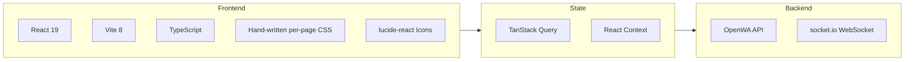
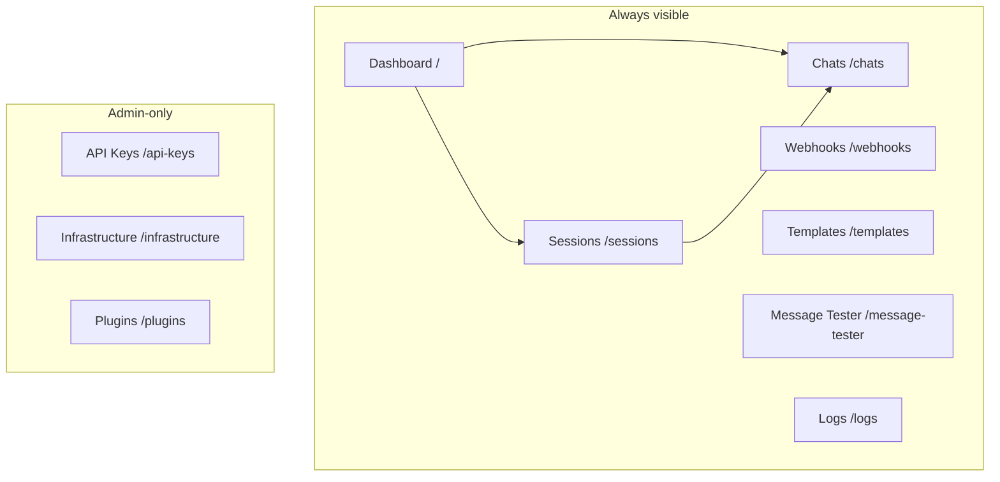

# 17 - Dashboard Design

## 17.1 Overview

The dashboard is a web-based management interface for OpenWA that lets users manage sessions, webhooks, and monitor activity without using the API directly.

### Tech Stack



The styling foundation is **plain CSS** — there is no Tailwind, no shadcn/ui, and no CSS-in-JS.
Each page and shared component ships its own stylesheet colocated beside the source
(`Sessions.tsx` + `Sessions.css`, `Layout.tsx` + `Layout.css`, ...), imported directly by the
component. Icons come from `lucide-react`; charts from `recharts`; i18n from `react-i18next`.
Client state is **TanStack Query** for server data (see `src/hooks/queries.ts`) plus a couple of
small React Context providers (`useRole`, `useTheme`) — there is no Zustand store.

### Design Principles

1. **Minimalist** - Clean, uncluttered interface
2. **Responsive** - Works on desktop and mobile
3. **Real-time** - Live updates via WebSocket
4. **Accessible** - WCAG 2.1 AA compliant
5. **Dark mode** - Support for light/dark themes

## 17.2 Information Architecture

The dashboard is a **flat, single-level route table** (see `src/App.tsx`). Each sidebar entry maps
to one top-level page — there are no nested detail/`:id` routes; a session or chat is opened in-place
(modals / split panes) rather than via its own URL.



### Navigation Structure

The route table lives in `src/App.tsx`; the sidebar items in `src/components/Layout.tsx`. Routes
guarded by `role === 'admin'` are only mounted (and only shown in the sidebar) for an admin key —
a non-admin hitting the path falls through to the `*` redirect.

```
/                  → Dashboard (overview + charts)
/sessions          → Sessions (create / start / stop / QR / delete)
/chats             → Chats (chat list + message thread, live via WebSocket)
/webhooks          → Webhooks (per-session webhook endpoints)
/templates         → Message Templates
/message-tester    → Message Tester (ad-hoc send-* + check-number)
/logs              → Activity / Audit Logs
/api-keys          → API Keys Management              [admin only]
/infrastructure    → Infrastructure status & config   [admin only]
/plugins           → Plugins (install / enable / configure) [admin only]
*                  → redirect to /
```

> There is **no Settings page** and no `/sessions/:id`, `/sessions/:id/chat`, or `/webhooks/:id`
> route. Theme (light/dark/system) and color-palette selection live in a popover menu in the sidebar
> footer (`Layout.tsx`), persisted client-side by the `useTheme` hook.

## 17.3 Wireframes

### Dashboard Home

```
┌─────────────────────────────────────────────────────────────────────┐
│  🔵 OpenWA                              🔍 Search    👤 Admin    ☀️  │
├─────────────────────────────────────────────────────────────────────┤
│                                                                      │
│  ┌─────────────┬─────────────┬─────────────┬─────────────┐          │
│  │   📱 5      │   ✅ 4      │   📨 1,234  │   🔗 3      │          │
│  │  Sessions   │  Connected  │   Messages  │  Webhooks   │          │
│  │             │             │   (Today)   │   Active    │          │
│  └─────────────┴─────────────┴─────────────┴─────────────┘          │
│                                                                      │
│  ┌──────────────────────────────────┐ ┌────────────────────────┐    │
│  │  Sessions Overview               │ │  Recent Activity       │    │
│  │  ┌──────┬──────┬──────┬──────┐  │ │                        │    │
│  │  │ 🟢   │ 🟢   │ 🟢   │ 🟡   │  │ │  10:30 Message sent    │    │
│  │  │ CS-1 │ CS-2 │ Sales│ Supp │  │ │  10:28 Webhook called  │    │
│  │  │ 123  │ 456  │  789 │  -   │  │ │  10:25 Session online  │    │
│  │  └──────┴──────┴──────┴──────┘  │ │  10:20 Message recv    │    │
│  │                                  │ │  10:15 QR scanned      │    │
│  │  [+ New Session]                 │ │                        │    │
│  └──────────────────────────────────┘ │  [View All →]          │    │
│                                        └────────────────────────┘    │
│                                                                      │
│  ┌──────────────────────────────────────────────────────────────┐   │
│  │  Message Volume (Last 7 Days)                                 │   │
│  │  ┌────────────────────────────────────────────────────────┐  │   │
│  │  │    ▓▓                                                   │  │   │
│  │  │    ▓▓     ▓▓                      ▓▓                   │  │   │
│  │  │    ▓▓     ▓▓  ▓▓            ▓▓    ▓▓                   │  │   │
│  │  │ ▓▓▓▓  ▓▓  ▓▓  ▓▓  ▓▓  ▓▓  ▓▓    ▓▓  ▓▓               │  │   │
│  │  │ Mon   Tue Wed Thu Fri  Sat Sun                         │  │   │
│  │  └────────────────────────────────────────────────────────┘  │   │
│  └──────────────────────────────────────────────────────────────┘   │
│                                                                      │
└─────────────────────────────────────────────────────────────────────┘
```

### Session List

```
┌─────────────────────────────────────────────────────────────────────┐
│  ← Sessions                                        [+ New Session]   │
├─────────────────────────────────────────────────────────────────────┤
│                                                                      │
│  🔍 Search sessions...              Filter: [All ▾] [Status ▾]      │
│                                                                      │
│  ┌───────────────────────────────────────────────────────────────┐  │
│  │ ● Customer Support 1                              🟢 Connected │  │
│  │   📱 +62 812-3456-789                                          │  │
│  │   📨 1,234 messages | Last active: 2 min ago                   │  │
│  │   ─────────────────────────────────────────────────────────── │  │
│  │   [📷 QR] [💬 Test Chat] [⚙️ Settings] [🗑️ Delete]             │  │
│  └───────────────────────────────────────────────────────────────┘  │
│                                                                      │
│  ┌───────────────────────────────────────────────────────────────┐  │
│  │ ● Sales Bot                                       🟢 Connected │  │
│  │   📱 +62 821-9876-543                                          │  │
│  │   📨 567 messages | Last active: 5 min ago                     │  │
│  │   ─────────────────────────────────────────────────────────── │  │
│  │   [📷 QR] [💬 Test Chat] [⚙️ Settings] [🗑️ Delete]             │  │
│  └───────────────────────────────────────────────────────────────┘  │
│                                                                      │
│  ┌───────────────────────────────────────────────────────────────┐  │
│  │ ○ Support Backup                              🟡 Disconnected  │  │
│  │   📱 Not connected                                             │  │
│  │   📨 0 messages | Never active                                 │  │
│  │   ─────────────────────────────────────────────────────────── │  │
│  │   [📷 Scan QR] [⚙️ Settings] [🗑️ Delete]                       │  │
│  └───────────────────────────────────────────────────────────────┘  │
│                                                                      │
│  ────────────────────────────────────────────────────────────────   │
│  Showing 3 of 3 sessions                              [◀] 1 [▶]     │
│                                                                      │
└─────────────────────────────────────────────────────────────────────┘
```

### Session Detail

```
┌─────────────────────────────────────────────────────────────────────┐
│  ← Sessions / Customer Support 1                    🟢 Connected     │
├─────────────────────────────────────────────────────────────────────┤
│                                                                      │
│  ┌─────────────────────────────────────────────────────────────┐    │
│  │  ┌─────────┐                                                │    │
│  │  │  👤     │  Customer Support 1                            │    │
│  │  │ Avatar  │  +62 812-3456-789                              │    │
│  │  │         │  Status: 🟢 Connected                          │    │
│  │  └─────────┘  Platform: Android                             │    │
│  │                                                              │    │
│  │  [Restart Session] [Logout] [Delete]                        │    │
│  └─────────────────────────────────────────────────────────────┘    │
│                                                                      │
│  ┌─────────────────────┬─────────────────────┐                      │
│  │  📊 Statistics      │  ⚙️ Configuration    │                      │
│  ├─────────────────────┼─────────────────────┤                      │
│  │                     │                     │                      │
│  │  Messages Sent      │  Auto Reconnect     │                      │
│  │  ████████░░ 1,234   │  [✓] Enabled        │                      │
│  │                     │                     │                      │
│  │  Messages Received  │  Webhook URL        │                      │
│  │  ██████████ 2,567   │  https://...        │                      │
│  │                     │                     │                      │
│  │  Webhook Calls      │  Proxy              │                      │
│  │  ███████░░░   890   │  None               │                      │
│  │                     │                     │                      │
│  │  Uptime             │  Created            │                      │
│  │  99.9% (30 days)    │  2026-01-15         │                      │
│  │                     │                     │                      │
│  └─────────────────────┴─────────────────────┘                      │
│                                                                      │
│  ┌─────────────────────────────────────────────────────────────┐    │
│  │  Recent Messages                          [View All →]      │    │
│  │  ───────────────────────────────────────────────────────── │    │
│  │  → +62 821... | Hello, how can I help?     | 10:30 ✓✓      │    │
│  │  ← +62 821... | I need product info        | 10:28          │    │
│  │  → +62 821... | Sure! Here's our catalog   | 10:25 ✓✓      │    │
│  │  ← +62 813... | Thanks for your help!      | 10:20          │    │
│  └─────────────────────────────────────────────────────────────┘    │
│                                                                      │
│  [💬 Open Test Chat]                                                 │
│                                                                      │
└─────────────────────────────────────────────────────────────────────┘
```

### QR Code Scanner

```
┌─────────────────────────────────────────────────────────────────────┐
│                          Scan QR Code                                │
├─────────────────────────────────────────────────────────────────────┤
│                                                                      │
│                    ┌─────────────────────────┐                       │
│                    │                         │                       │
│                    │   ████████████████████  │                       │
│                    │   ██              ████  │                       │
│                    │   ██  ██████████  ████  │                       │
│                    │   ██  ██      ██  ████  │                       │
│                    │   ██  ██      ██  ████  │                       │
│                    │   ██  ██      ██  ████  │                       │
│                    │   ██  ██████████  ████  │                       │
│                    │   ██              ████  │                       │
│                    │   ████████████████████  │                       │
│                    │                         │                       │
│                    └─────────────────────────┘                       │
│                                                                      │
│                    Expires in: 0:45                                  │
│                                                                      │
│     ──────────────────────────────────────────────────────          │
│                                                                      │
│     1. Open WhatsApp on your phone                                   │
│     2. Tap Menu ⋮ or Settings ⚙                                     │
│     3. Tap Linked Devices                                            │
│     4. Tap Link a Device                                             │
│     5. Point your phone at this screen                               │
│                                                                      │
│     ──────────────────────────────────────────────────────          │
│                                                                      │
│                    [Refresh QR] [Cancel]                             │
│                                                                      │
└─────────────────────────────────────────────────────────────────────┘
```

### Test Chat Interface

```
┌─────────────────────────────────────────────────────────────────────┐
│  ← Test Chat                              Session: Customer Support  │
├─────────────────────────────────────────────────────────────────────┤
│                                                                      │
│  ┌──────────────────────┐ ┌────────────────────────────────────┐    │
│  │  Contacts            │ │  +62 821-9876-543                  │    │
│  │  ──────────────────  │ │  John Doe                          │    │
│  │                      │ ├────────────────────────────────────┤    │
│  │  🔍 Search...        │ │                                    │    │
│  │                      │ │  ┌──────────────────────────────┐ │    │
│  │  ┌────────────────┐  │ │  │ Hello! How can I help you?  │ │    │
│  │  │ 👤 John Doe    │  │ │  │                    10:30 ✓✓ │ │    │
│  │  │    Last: Hi!   │  │ │  └──────────────────────────────┘ │    │
│  │  └────────────────┘  │ │                                    │    │
│  │                      │ │      ┌─────────────────────────┐   │    │
│  │  ┌────────────────┐  │ │      │ I need help with my    │   │    │
│  │  │ 👤 Jane Smith  │  │ │      │ order #12345           │   │    │
│  │  │    Last: OK    │  │ │      │              10:31     │   │    │
│  │  └────────────────┘  │ │      └─────────────────────────┘   │    │
│  │                      │ │                                    │    │
│  │  ┌────────────────┐  │ │  ┌──────────────────────────────┐ │    │
│  │  │ 👤 Bob Wilson  │  │ │  │ Sure! Let me check that    │ │    │
│  │  │    Last: Thx   │  │ │  │ for you. One moment...     │ │    │
│  │  └────────────────┘  │ │  │                    10:32 ✓✓ │ │    │
│  │                      │ │  └──────────────────────────────┘ │    │
│  │                      │ │                                    │    │
│  │  ──────────────────  │ ├────────────────────────────────────┤    │
│  │  [+ New Chat]        │ │  📎 [                        ] 📤  │    │
│  └──────────────────────┘ │     Type a message...              │    │
│                           └────────────────────────────────────┘    │
│                                                                      │
└─────────────────────────────────────────────────────────────────────┘
```

### Webhook Management

```
┌─────────────────────────────────────────────────────────────────────┐
│  ← Webhooks                                      [+ New Webhook]     │
├─────────────────────────────────────────────────────────────────────┤
│                                                                      │
│  ┌───────────────────────────────────────────────────────────────┐  │
│  │  🔗 Main Webhook                                   ✅ Active   │  │
│  │  https://api.example.com/webhook/openwa                        │  │
│  │  Events: message.received, message.ack, session.status         │  │
│  │  Sessions: All                                                 │  │
│  │  ──────────────────────────────────────────────────────────── │  │
│  │  Success Rate: 99.8% | Avg Latency: 125ms | Last: 2 min ago   │  │
│  │  [Test] [View Logs] [Edit] [Disable]                          │  │
│  └───────────────────────────────────────────────────────────────┘  │
│                                                                      │
│  ┌───────────────────────────────────────────────────────────────┐  │
│  │  🔗 Analytics Webhook                              ✅ Active   │  │
│  │  https://analytics.example.com/track                           │  │
│  │  Events: message.received                                      │  │
│  │  Sessions: cs-1, sales                                         │  │
│  │  ──────────────────────────────────────────────────────────── │  │
│  │  Success Rate: 100% | Avg Latency: 89ms | Last: 5 min ago     │  │
│  │  [Test] [View Logs] [Edit] [Disable]                          │  │
│  └───────────────────────────────────────────────────────────────┘  │
│                                                                      │
│  ┌───────────────────────────────────────────────────────────────┐  │
│  │  🔗 Backup Webhook                              ⏸️ Disabled    │  │
│  │  https://backup.example.com/wa                                 │  │
│  │  Events: message.received, message.ack                         │  │
│  │  Sessions: All                                                 │  │
│  │  ──────────────────────────────────────────────────────────── │  │
│  │  [Enable] [Edit] [Delete]                                     │  │
│  └───────────────────────────────────────────────────────────────┘  │
│                                                                      │
└─────────────────────────────────────────────────────────────────────┘
```

## 17.4 Component Library

> **No component framework is installed.** shadcn/ui is *not* adopted — there is no `npx shadcn`
> init, no `components/ui/` directory, no `cn()` utility, and no `@/components` import alias. The
> wireframes above are design intent; the implementation is hand-written.

### Bespoke components

The UI is built from a small set of project-specific components under `dashboard/src/components/`,
each with a colocated CSS file. There is no design-system package to pull from.

| Component | File | Responsibility |
| --- | --- | --- |
| `Layout` | `components/Layout.tsx` | App shell: collapsible sidebar nav, mobile drawer, language menu, theme/palette popover, logout, live version badge |
| `ToastProvider` / `useToast` | `components/Toast.tsx` | Context-based toast notifications (success/error/warning/info) with de-dup keys |
| `PageHeader` | `components/PageHeader.tsx` | Shared page title / subtitle / badge / actions header |
| `DashboardCharts` | `components/DashboardCharts.tsx` | `recharts`-based message-volume / activity charts on the Dashboard |
| `FilterBuilder` | `components/FilterBuilder.tsx` | Visual condition builder for webhook event filters |
| `ErrorBoundary` | `components/ErrorBoundary.tsx` | Top-level React error boundary wrapping the whole app |
| `GithubIcon` | `components/GithubIcon.tsx` | Inline brand SVG |

Pages live under `dashboard/src/pages/`, each as a `*.tsx` + `*.css` pair (e.g. `Sessions.tsx` +
`Sessions.css`). Pages are lazy-loaded in `App.tsx` via `React.lazy` + `Suspense`.

A representative bespoke component — the shared page header — shows the actual conventions
(plain props, a colocated stylesheet, BEM-ish class names, no utility classes):

```typescript
// components/PageHeader.tsx
import type { ReactNode } from 'react';
import './PageHeader.css';

interface PageHeaderProps {
  title: string;
  subtitle?: string;
  badge?: ReactNode;
  actions?: ReactNode;
}

export function PageHeader({ title, subtitle, badge, actions }: PageHeaderProps) {
  return (
    <header className="page-header">
      <div className="page-header__title-group">
        <h1>{title}</h1>
        {badge && <span className="page-header__badge">{badge}</span>}
      </div>
      {actions && <div className="page-header__actions">{actions}</div>}
      {subtitle && <p className="page-header__subtitle">{subtitle}</p>}
    </header>
  );
}
```

Icons are imported individually from `lucide-react`; there is no `Avatar`/`Card`/`Badge` primitive
library — those visuals are composed directly with `div`s and the page's own CSS.

## 17.5 State Management

There is **no Zustand store** (and no global client-state library). Server data is owned by
**TanStack Query** (`@tanstack/react-query`); the only other shared state is two small React Context
providers — `useRole` (the authenticated key's role) and `useTheme` (mode + palette, persisted to
`localStorage`).

### API client — raw payloads, no `{ data }` envelope

The client lives in `src/services/api.ts`. A single `request<T>()` helper attaches the `X-API-Key`
header from `sessionStorage`, then returns **the parsed JSON body as-is** — the backend sends the
raw handler payload, so `request<Session[]>('/sessions')` resolves to a bare `Session[]`, not
`{ data: Session[] }`. (A `204 No Content` resolves to `undefined`; a `401` clears the stored key
and redirects to login.) Endpoints are grouped into typed namespaces — `sessionApi`, `webhookApi`,
`templateApi`, `apiKeyApi`, `auditApi`, `messageApi`, `infraApi`, `pluginsApi`, `statsApi`, ...

```typescript
// src/services/api.ts (abridged)
export const API_BASE_URL = `${(import.meta.env.VITE_API_URL ?? '').replace(/\/+$/, '')}/api`;

async function request<T>(endpoint: string, options: RequestInit = {}): Promise<T> {
  const apiKey = sessionStorage.getItem('openwa_api_key');
  const response = await fetch(`${API_BASE_URL}${endpoint}`, {
    ...options,
    headers: {
      'Content-Type': 'application/json',
      ...(apiKey ? { 'X-API-Key': apiKey } : {}),
      ...options.headers,
    },
  });
  if (!response.ok) {
    const error = await response.json().catch(() => ({}));
    throw new Error(error.message || `HTTP ${response.status}`);
  }
  if (response.status === 204) return undefined as T;
  return response.json(); // ← the raw payload, no unwrapping
}

export const sessionApi = {
  list: () => request<Session[]>('/sessions'),          // bare array
  get: (id: string) => request<Session>(`/sessions/${id}`),
  create: (name: string) =>
    request<Session>('/sessions', { method: 'POST', body: JSON.stringify({ name }) }),
  delete: (id: string) => request<void>(`/sessions/${id}`, { method: 'DELETE' }),
  // QR returns a raw { qrCode, status } object — not { qr, expiresAt }, and there is no expiry timer.
  getQR: (id: string) => request<{ qrCode: string; status: string }>(`/sessions/${id}/qr`),
};
```

### TanStack Query hooks

Hooks wrap those namespaces in `src/hooks/queries.ts` — each returns the raw payload directly (no
`.data.data`). Cache invalidation, not a store, keeps the UI in sync after a mutation.

```typescript
// src/hooks/queries.ts (abridged)
import { useQuery, useMutation, useQueryClient } from '@tanstack/react-query';
import { sessionApi, webhookApi } from '../services/api';

export const queryKeys = {
  sessions: ['sessions'] as const,
  webhooks: ['webhooks'] as const,
  // ...
};

export function useSessionsQuery() {
  return useQuery({
    queryKey: queryKeys.sessions,
    queryFn: sessionApi.list, // resolves to Session[] directly
    staleTime: 30_000,
  });
}

export function useStopSessionMutation() {
  const queryClient = useQueryClient();
  return useMutation({
    mutationFn: (id: string) => sessionApi.stop(id),
    onSuccess: () => void queryClient.invalidateQueries({ queryKey: queryKeys.sessions }),
  });
}
```

> **There is no `useSessionQr` polling hook.** QR codes are not fetched on a 30 s
> `refetchInterval`. The Sessions page fetches the current QR imperatively via `sessionApi.getQR()`
> and then receives fresh codes pushed over the WebSocket (`session.qr` events, see §17.6).

## 17.6 WebSocket Integration

Real-time updates use **socket.io** (`socket.io-client`), not a raw browser `WebSocket`. The hook is
`src/hooks/useWebSocket.ts`. Key facts:

- **Namespace `/events`** (not `/ws`). The client connects to
  `${VITE_WS_URL || window.location.origin}/events` — same-origin by default; `VITE_WS_URL` only
  overrides it for split-origin deployments.
- **API key via the socket.io `auth` payload (and an `X-API-Key` header for proxies), deliberately
  *not* in the query string** — a key in the handshake URL would leak into access logs / `Referer`.
- **Reconnection is socket.io's built-in mechanism** — `reconnectionAttempts: 5`,
  `reconnectionDelay: 1000` — not a hand-rolled `setTimeout(connect, 3000)`. When all attempts are
  exhausted the manager fires `reconnect_failed`; the hook surfaces that as `connectionFailed` so the
  UI can offer a manual `reconnect()`.
- **Server → client envelope.** Every push arrives as a single `message` event whose payload is
  `{ type: 'event', timestamp, payload: { event, sessionId, data } }`. The hook registers one
  handler, switches on `payload.event`, and fans out to typed callbacks.
- **Subscriptions** are sent with `socket.emit('message', { type: 'subscribe' | 'unsubscribe', ... })`.

```typescript
// src/hooks/useWebSocket.ts (abridged)
import { useEffect, useRef, useCallback, useState } from 'react';
import { io, Socket } from 'socket.io-client';

const SOCKET_URL = import.meta.env.VITE_WS_URL || window.location.origin;

interface ServerEventEnvelope {
  type: string;        // 'event'
  timestamp: string;
  payload?: { event: string; sessionId: string; data: Record<string, unknown> };
}

export function useWebSocket(events: WebSocketEvents = {}) {
  const socketRef = useRef<Socket | null>(null);
  const [isConnected, setIsConnected] = useState(false);
  const [connectionFailed, setConnectionFailed] = useState(false);

  const connect = useCallback(() => {
    if (socketRef.current?.connected) return;
    const apiKey = sessionStorage.getItem('openwa_api_key');
    if (!apiKey) return;

    socketRef.current = io(`${SOCKET_URL}/events`, {
      reconnection: true,
      reconnectionAttempts: 5,
      reconnectionDelay: 1000,
      auth: { apiKey },                       // key in the handshake auth, NOT the URL
      extraHeaders: { 'X-API-Key': apiKey },  // header copy for proxies
    });

    socketRef.current.on('connect', () => { setIsConnected(true); setConnectionFailed(false); });
    socketRef.current.on('disconnect', () => setIsConnected(false));
    socketRef.current.io.on('reconnect_failed', () => setConnectionFailed(true));
  }, []);

  useEffect(() => {
    connect();
    const socket = socketRef.current;
    const handle = (msg: ServerEventEnvelope) => {
      if (!msg || msg.type !== 'event' || !msg.payload) return;
      const { event, sessionId, data } = msg.payload;
      switch (event) {
        case 'session.status':
          events.onSessionStatus?.({ sessionId, status: String(data.status), timestamp: msg.timestamp });
          break;
        case 'session.qr':
          events.onQRCode?.({ sessionId, qrCode: String(data.qrCode), timestamp: msg.timestamp });
          break;
        case 'message.received':
        case 'message.sent':
          events.onMessage?.({ sessionId, message: data, timestamp: msg.timestamp });
          break;
        // ...message.ack, message.reaction, message.revoked
      }
    };
    socket?.on('message', handle);
    return () => { socket?.off('message', handle); };
  }, [connect, events]);

  return { isConnected, connectionFailed, reconnect, subscribe, unsubscribe };
}
```

## 17.7 Theme Configuration

Theming is **not** shadcn HSL design tokens. It is a plain `useTheme` hook (`src/hooks/useTheme.ts`)
that toggles two attributes on `<html>` and lets the CSS do the rest. The values are persisted to
`localStorage` under `openwa_theme` and `openwa_palette`:

- **Mode** — `light | dark | system`. `system` removes `data-theme` so a `prefers-color-scheme`
  media query in the global CSS takes over; otherwise `data-theme="light|dark"` is set explicitly.
- **Palette** — one of seven accent palettes (`openwa`, `blue`, `graphite`, `indigo`, `amber`,
  `rose`, `teal`), applied as `data-palette="…"`. Each palette is a set of CSS custom properties
  scoped to that attribute selector.

The mode/palette pickers render in the sidebar footer popover (`Layout.tsx`); there is no
`ThemeProvider` context wrapper — it's a hook consumed directly where needed.

```typescript
// src/hooks/useTheme.ts (abridged)
export type Theme = 'light' | 'dark' | 'system';
export type ThemePalette = 'openwa' | 'blue' | 'graphite' | 'indigo' | 'amber' | 'rose' | 'teal';

export function useTheme() {
  const [theme, setTheme] = useState<Theme>(/* localStorage 'openwa_theme' ?? 'system' */);
  const [palette, setPalette] = useState<ThemePalette>(/* localStorage 'openwa_palette' ?? 'openwa' */);

  useEffect(() => {
    const root = document.documentElement;
    if (theme === 'system') root.removeAttribute('data-theme');
    else root.setAttribute('data-theme', theme);
    localStorage.setItem('openwa_theme', theme);
  }, [theme]);

  useEffect(() => {
    document.documentElement.setAttribute('data-palette', palette);
    localStorage.setItem('openwa_palette', palette);
  }, [palette]);

  return { theme, setTheme, palette, setPalette, /* resolvedTheme, paletteOptions, ... */ };
}
```

The actual colors live in the global CSS as variables keyed off `[data-theme]` / `[data-palette]` —
e.g. `:root { --color-accent: #25d366; } [data-palette='blue'] { --color-accent: #2563eb; }` — so
switching mode or palette is a single attribute write with no re-render of the tree.

## 17.8 Build & Deployment

### Vite Configuration

The dev server listens on **2886** and proxies `/api` to the API on `2785`. The WebSocket proxy is
on **`/socket.io`** (socket.io's transport path) with `ws: true` — *not* `/ws`. There is no `@`
import alias and no custom `manualChunks`/Radix vendor split; code-splitting is handled by the
per-page `React.lazy` imports in `App.tsx`. The build-time version (`__APP_VERSION__`) is injected
from `package.json` via `define`.

```typescript
// vite.config.ts
import { readFileSync } from 'node:fs';
import { resolve } from 'node:path';
import { defineConfig } from 'vite';
import react from '@vitejs/plugin-react';

const { version: pkgVersion } = JSON.parse(
  readFileSync(resolve(process.cwd(), 'package.json'), 'utf-8'),
) as { version: string };

export default defineConfig({
  plugins: [react()],
  appType: 'spa', // SPA fallback for client-side routing
  define: {
    __APP_VERSION__: JSON.stringify(process.env.APP_VERSION || pkgVersion),
    __BUILD_TIME__: JSON.stringify(new Date().toISOString()),
  },
  server: {
    port: 2886,
    proxy: {
      '/api': {
        target: 'http://localhost:2785',
        changeOrigin: true,
        secure: false,
      },
      // socket.io transport — NOT '/ws'
      '/socket.io': {
        target: 'http://localhost:2785',
        ws: true,
        changeOrigin: true,
      },
    },
  },
});
```

### Production Build & Serving

The dashboard has **no container of its own**. In production the NestJS API serves the bundled
SPA from the same process and port (default `2785`) via `@nestjs/serve-static`, so there is no
nginx image and no separate dashboard service to deploy.

How it fits together:

- `npm run build:all` builds the API (`dist/`) **and** the dashboard (`dashboard/dist/`). The root
  `Dockerfile` does this in its builder stage and copies `dashboard/dist` into the runtime image.
- `ServeStaticModule` is registered conditionally in `src/app.module.ts`: it only activates when
  `dashboard/dist/index.html` exists, serves it with SPA fallback, and `exclude`s `/api` and
  `/socket.io` so those keep returning real API/WebSocket responses. Opt out with
  `SERVE_DASHBOARD=false`.
- Run it directly with `npm run prod` (build + serve) or `node dist/main` against a prebuilt image.

In development the build is absent, so serve-static stays inert and the Vite dev server (port
`2886`, see above) handles the UI with HMR while proxying `/api` + `/socket.io` to the API.

**Split-origin hosting is still supported.** Same-origin serving is the default, not a lock-in: to
host the dashboard separately (a CDN, an object store, or its own container), build it with the API
origin baked in and deploy `dashboard/dist` wherever you like:

```bash
VITE_API_URL=https://api.example.com npm run build   # in dashboard/
```

`dashboard/src/services/api.ts` reads `VITE_API_URL` and calls that origin instead of same-origin
`/api`. Set `SERVE_DASHBOARD=false` on the API so it stops serving its own copy. Remember to add the
dashboard's origin to `CORS_ORIGINS` on the API.

For TLS or public exposure of the default single-port setup, terminate at your own reverse proxy
(nginx, Caddy, a cloud load balancer, or a k8s Ingress) in front of the API; see
`docs/12-troubleshooting-faq.md` for an nginx example.

---

<div align="center">

[← 16 - Risk Management](./16-risk-management.md) · [Documentation Index](./README.md) · [Next: 18 - SDK Design →](./18-sdk-design.md)

</div>
