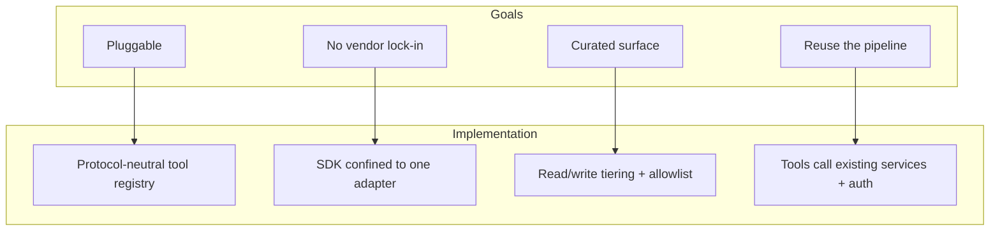
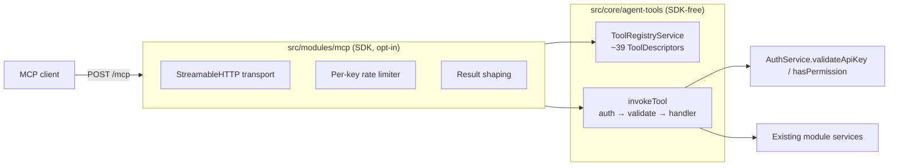

# 24 - MCP Integration (Agent Tools)

## Implementation Status

> **Current Status: ✅ Implemented — opt-in, off by default**
>
> OpenWA can expose a curated set of its capabilities to AI agents over the
> [Model Context Protocol](https://modelcontextprotocol.io). The server is **off by
> default** and **purely additive**: when disabled, none of its code (or the MCP SDK)
> is loaded and every REST route behaves exactly as before.

| Component | Status | Location |
|-----------|--------|----------|
| **Tool registry (`ToolDescriptor`)** | ✅ Implemented | `src/core/agent-tools/tool-descriptor.ts` |
| **Tool invoker (auth → validate → service)** | ✅ Implemented | `src/core/agent-tools/tool-invoker.ts` |
| **Registry service** | ✅ Implemented | `src/core/agent-tools/tool-registry.service.ts` |
| **Curated tool tables (~39 tools)** | ✅ Implemented | `src/core/agent-tools/tools/*.tools.ts` |
| **MCP transport adapter** | ✅ Implemented | `src/modules/mcp/mcp.server.ts` |
| **Opt-in module gate** | ✅ Implemented | `src/modules/mcp/mcp.module.ts`, `src/app.module.ts` |
| **Per-key rate limiter** | ✅ Implemented | `src/modules/mcp/mcp-rate-limit.ts` |
| **Result shaping (smart/json)** | ✅ Implemented | `src/modules/mcp/tool-result.ts` |

| Capability | Status | Notes |
|-----------|--------|-------|
| **Read-only mode** | ✅ Implemented | `MCP_READONLY=true` mounts read tools only |
| **OAuth 2.1 (public exposure)** | 🔜 Planned | Static API key is used today (suitable for self-hosted/internal) |
| **Agent-action audit provenance** | 🔜 Planned | Mark audited actions as agent-initiated |
| **Env-tunable rate limits** | ✅ Implemented | `MCP_RATE_LIMIT_MAX` / `MCP_RATE_LIMIT_WINDOW_MS` |
| **Additional tool domains** | 🔜 Planned | labels / templates / channels / catalog / status as an opt-in expansion |

---

## 24.1 Overview

MCP lets AI agents (Claude, Cursor, and other MCP clients) call external capabilities
as first-class tools. OpenWA's MCP integration exposes a **focused, curated** slice of
its functionality — listing sessions, sending messages, reading chats/contacts, basic
group management — so an agent can drive WhatsApp through the same business logic the
REST API uses.

Set `MCP_ENABLED=true` to mount a stateless Streamable-HTTP transport at **`POST /mcp`**
on the existing server (same port, no extra process). When `MCP_ENABLED` is unset, the
MCP module and the `@modelcontextprotocol/sdk` package are never loaded.

## 24.2 Design Goals



1. **Pluggable.** The agent surface is a protocol-neutral registry of `ToolDescriptor`s,
   mirroring how the engine layer treats whatsapp-web.js/Baileys as adapters. MCP is one
   transport adapter over that registry; another protocol could be added without touching
   core.
2. **No vendor lock-in.** Core never imports the MCP SDK. The `@modelcontextprotocol/sdk`
   dependency lives in exactly one place (`src/modules/mcp/`) and is loaded only when MCP
   is enabled.
3. **Curated surface.** Rather than reflecting every REST route, OpenWA exposes an
   intentional, named, read/write-tiered set of tools. A focused surface keeps agents from
   getting overwhelmed and keeps destructive/privileged operations off the agent path.
4. **Reuse the pipeline.** Each tool runs through the **existing services** and the
   **existing authentication** (API key + role + per-session scoping) and reuses the same
   response-shaping (DTOs) as REST — so the agent surface stays in lockstep with REST and
   re-implements no security logic.

## 24.3 Architecture



A tool call flows through four steps, in this order:

1. **Key extraction.** The adapter reads the API key from the `X-API-Key` header or
   `Authorization: Bearer …`.
2. **Authentication.** `invokeTool` calls `AuthService.validateApiKey()` — the *same*
   method the REST `ApiKeyGuard` uses — which enforces validity, expiry, the per-session
   `allowedSessions` scope, and the IP allow-list (fail-closed). Then `hasPermission()`
   enforces the tool's required role. Auth runs **before** the handler.
3. **Validation.** The tool's Zod input schema validates the arguments (a failure maps to
   a `400`-style error), exactly bounding what reaches the service.
4. **Execution.** The handler calls the existing service method and shapes the result
   through the same response DTO the REST controller uses (so no field is exposed over MCP
   that REST hides).

The transport is **stateless**: each request mints its own server/transport and tears it
down on response close — any request can hit any instance.

## 24.4 The Tool Surface

The surface is an **allowlist by construction** — a capability is exposed only if a
`ToolDescriptor` is written for it. There is no automatic route reflection. Each tool
declares a `tier` (`read` | `write`) and, for writes, a required role.

| Domain | Read tools | Write tools |
|--------|-----------|-------------|
| **Session** | list, get, chats, stats | mark read/unread, typing |
| **Message** | list, history, reactions | send text/image/video/audio/document/location/contact/sticker/template, reply, forward, react |
| **Contact** | list, get, check-number, resolve-phone, profile-picture | block, unblock |
| **Group** | list, get, invite-code | create, add participants, set subject, set description |
| **Webhook** | list, get (read-only) | — |

**Deliberately excluded from the surface** (not exposed as tools): session lifecycle
(create/delete/start/stop/force-kill), chat delete, bulk send, message delete, group
leave/remove/promote/demote/invite-revoke, all API-key management, all plugin management,
infrastructure import/export/restart, settings writes, and webhook create/update/delete.
These are destructive, privileged, or have no agent use case.

### Read-only mode

Set `MCP_READONLY=true` to mount **only** `tier: 'read'` tools. This is the recommended
posture when an agent only needs to observe.

## 24.5 Authentication & Security

- **Same authorization as REST.** Tool calls are authorized by `AuthService` — role and
  per-session `allowedSessions` scoping are enforced identically to REST. A key scoped to
  one session cannot act on another.
- **Least-privilege keys.** Mint a **dedicated, non-admin, session-scoped** key for each
  MCP client (`OPERATOR` role at most). The plaintext key is shown once on creation; to
  rotate, create a new key and delete the old one.
- **No IP allow-list over MCP.** There is no genuine client IP on a tool call, so a key
  that carries an `allowedIps` list will be rejected. Use a key without `allowedIps` for
  MCP.
- **Rate limiting.** A per-key limiter (keyed by the *authenticated* key id) bounds tool
  calls. Buckets are pruned when idle. This is independent of the REST throttler.
  Tune with `MCP_RATE_LIMIT_MAX` (default `60`) and `MCP_RATE_LIMIT_WINDOW_MS`
  (default `60000`). Any missing, blank, non-positive, or non-numeric value falls back
  to the default.
- **Response parity.** Tools reuse the REST response DTOs, so sensitive fields the REST
  API strips (e.g. webhook HMAC secrets and custom headers, session proxy URLs and engine
  config) are **not** exposed over MCP.
- **Do not expose `/mcp` to the public internet** without a fronting authentication proxy.
  The static API key is appropriate for a self-hosted, locally/network-reached deployment;
  public exposure should wait for OAuth 2.1 support (planned).

## 24.6 Enabling & Client Setup

```bash
MCP_ENABLED=true npm run start:prod   # or set MCP_ENABLED in your .env / compose
# optional:
MCP_READONLY=true                     # read tools only
MCP_RATE_LIMIT_MAX=60                 # max tool calls per key per window (default 60)
MCP_RATE_LIMIT_WINDOW_MS=60000        # sliding window in ms (default 60000 = 1 min)
```

Point an MCP client at `POST /mcp`. For Claude Code, a `.mcp.json` at your project root
(gitignored — replace the key with a real one from `data/.api-key`):

```json
{
  "mcpServers": {
    "openwa": {
      "type": "http",
      "url": "http://localhost:2785/mcp",
      "headers": { "Authorization": "Bearer YOUR_API_KEY" }
    }
  }
}
```

From the client, list tools (you should see the curated set, or only read tools under
`MCP_READONLY`) and call one (e.g. `SessionFindAll`) to confirm auth and execution.

## 24.7 Extending — Adding a Tool

A tool is a `ToolDescriptor`: a name, an agent-legible description, a Zod input schema, a
tier, and a `handler` that calls a service. To add one, append to the relevant table in
`src/core/agent-tools/tools/<domain>.tools.ts`:

```ts
{
  name: 'SessionFindOne',
  description: 'Get one session by its UUID, including connection status.',
  tier: 'read',
  sessionScoped: true,
  inputSchema: z.object({ sessionId: z.string().min(1).describe('Session UUID') }),
  handler: (input, _apiKey) => session.findOne(input.sessionId).then(SessionResponseDto.fromEntity),
}
```

Guidelines:

- **Reuse the response DTO** the matching REST controller uses (e.g.
  `WebhookResponseDto.fromEntity`, `SessionResponseDto.fromEntity`). Returning a raw entity
  can leak fields the REST API deliberately strips.
- Mark writes with `tier: 'write'` and the appropriate `requiredRole`.
- Use `sessionScoped: true` and a non-empty `sessionId` field for any per-session tool so
  the scope check applies.
- A snapshot test (`tool-registry.spec.ts`) locks the public tool-name set; update it
  intentionally when the surface changes.

## 24.8 Limitations & Roadmap

- **OAuth 2.1 / PKCE** for public, internet-facing deployments (today: static API key,
  intended for self-hosted/internal use).
- **Agent-action audit provenance** — record that an audited action was agent-initiated
  and by which key.
- **Expansion-pack tool domains** — labels, templates, channels, catalog, and status are
  not in the default surface yet.
- **Stateful MCP sessions / SSE reconnect, prompts, elicitation** — out of scope; the
  transport is intentionally stateless.

---

> See also: [03 - System Architecture](03-system-architecture.md),
> [04 - Security Design](04-security-design.md),
> [19 - Plugin Architecture](19-plugin-architecture.md).
